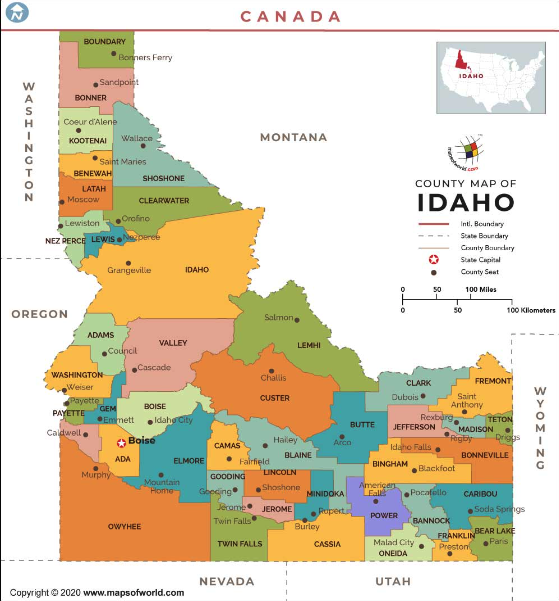
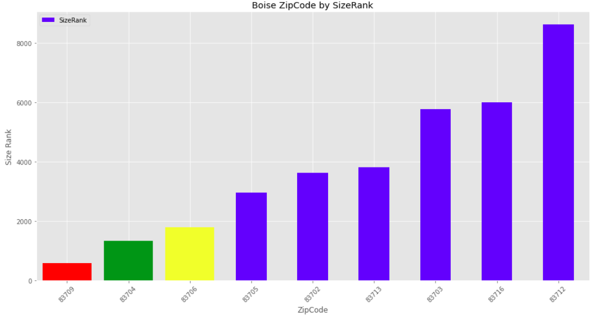
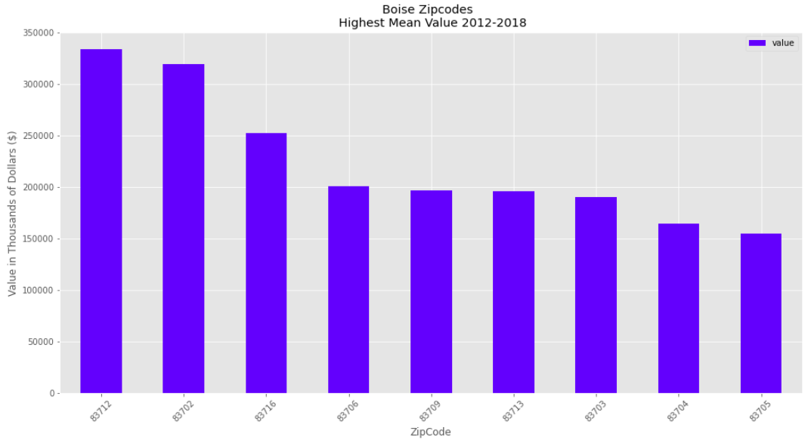
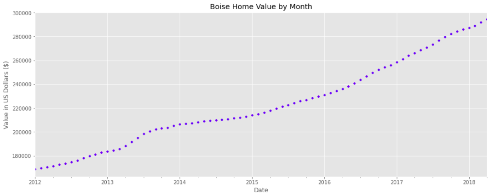
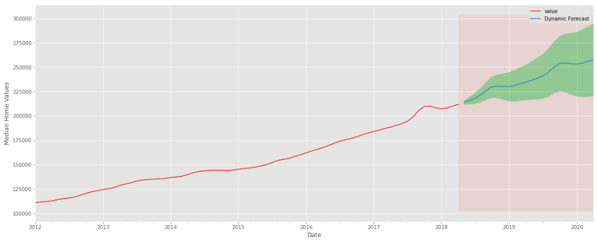

# Project Four: Boise Home Value Analysis
---
**Author: Michael Holthouser**




### Data Used
The data was provided by Zillow.


### Business Understanding
---

World Wide Real Estate Investments is looking for their new real estate investment opportunity, and they have their eyes set on Idaho. During the coronavirus pandemic, the state of Idaho had seen the largest net gain in population than any other state. World Wide Real Estate Investments wants get a piece of this pie before it's too late.

I have been tasked by World Wide Real Estate Investments to recommend the top 5 zip codes in Idaho. My responsibility is to forecast the top 5 zip codes in terms of ROI (return of investment) for the company to invest in.

### Data Selection
---

I had chosen to filter the data to only looking at zip codes in **Boise, Idaho**. I chose Boise as the "best" area to analyze not only because it is the largest city in Idaho, but because millennials are quickly relocating there. "In 2018, Boise was the fastest-growing city according to Forbes." Many Californians are moving to Boise because of the cost of living is much more affordable than California, a better work-life balance, and access to nature.  <a href="https://www.businessinsider.com/why-millennials-are-moving-from-california-to-boise-idaho-2019-12">Business Insider</a>. 

### Column Descriptions
---

- <code><b>RegionID</b></code>, numerical. This is a unique Id for the regions. 
- <code><b>RegionName</b></code>, numerical. This field contains the zip code of the region.
- <code><b>City</b></code>, string. This column provides the specific city name of the housing data. 
- <code><b>State</b></code>, string. This column provides the specific state name.
- <code><b>Metro</b></code>, string. This provides the name of the metro city that surrounds that region. 
- <code><b>CountyName</b></code>, string. This is the county name for that region. 
- <code><b>SizeRank</b></code>, string. This is the ranking done based on the urbanization of the area. 
- <code><b>Dates</b></code>, The next several columns provide the month and the year with the median price of a real estate.

### Data Cleaning and Preparation
---

- Filtered for records only from the state of Idaho.
- Renamed RegionName to ZipCode for clarification. 
- Dropped Unnecessary columns from the dataset. 
- Checked and removed any missing data. 
- Reshaped the dataset from a wide format to a long format. 
- Set the date as the index for time series modeling. 
- Resampled the index to 'MS' (month start).

### EDA
---

#### SizeRank of Boise ZipCodes

- SizeRank is the a ranking done based on the urbanization of the area. Boise is the largest city in Idaho and has 9 zipcodes. The image ranks the ZipCodes from largest to smallest.
- I have changed the color of the top three largest ZipCodes in term of RankSize.




#### Boise ZipCodes Mean Value of Homes 

- The image below shows the mean value of homes in the ZipCodes located in Boise. 
- There are three clear ZipCodes with higher valued homes than the rest. 




#### Boise Home Value Trend 

- The image below shows the upward positive trend of home values in Boise. 
- Some years don't show as steep of a upward trend, but every year still shows an increase in value of homes. 



### Modeling and Results
---

I had 9 ZipCodes to model. I modeled with SARIMAX and forecasted a confidence interval. I also used the average 2 year ROI (return on investment) percentage so each zip code could be compared to determine the "best" ZipCode to invest in. After finally completing this process, the top 5 ZipCodes with the highest 2 year ROI were determined.

- The ROI equation includes dividing by initial predicted average that varies by zip code which is why percentage may not be clearly represent the graph. The best graph was that of the ZipCode 83705.



#### Best ZipCodes

1. 83703: **24%** 
2. 83702: **22%**
3. 83705: **20%**
4. 83704: **18%**
5. 83706: **18%**

#### ZipCode Recommendations

- The ROI percentage represents the appreciation in property value of a home in Boise, ID over a 2 year span. I believe even though we are just analyzing the ROI in the short term, the value of homes in Boise will continue to rise. 
- Though all top 5 zip codes have forecasted to be profitable, I recommend investing in properties in the 83703 first. The inital invest is low and the profit margin is excellent, and doesn't show signs of slowing down. 

### Future Work
---

In the future, I would like to look into other cities in Idaho to see how they compare to the state's capitol. Additionally, future work could include using a greater range than 0 and 2 on pdq parameters in SARIMAX modeling. 

I would also like to see how idaho compares to other up and coming States in the US.

### Repository Structure
---

```
├── images
├── time-series
├── .gitignore
├── Presentation.pdf
├── Presentation.pptx
├── README.ipynb
├── README.md
├── final_notebook.ipynb
├── final_notebook.ipynb
├── 
```
